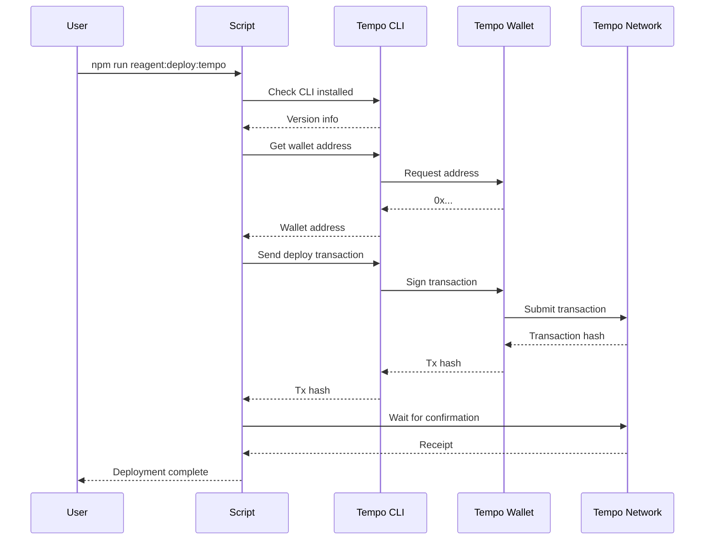

# REAGENT Token Deployment with Tempo CLI

## Overview

Deploy REAGENT token menggunakan Tempo Wallet CLI untuk deployment otomatis tanpa perlu manage private keys secara manual. Tempo CLI menyediakan wallet dengan built-in spend controls dan service discovery.

## Keuntungan Menggunakan Tempo CLI

✅ **No Manual Key Management**: Tidak perlu copy-paste private keys
✅ **Built-in Security**: Spend controls dan authentication built-in
✅ **Browser-based Auth**: Login menggunakan browser untuk keamanan
✅ **Automatic Transactions**: CLI handles transaction signing otomatis
✅ **Service Discovery**: Discover dan pay for services on-demand

## Prerequisites

1. **Node.js** dan **npm** terinstall
2. **Tempo CLI** (akan diinstall otomatis)
3. **Browser** untuk authentication
4. **Test tokens** untuk gas fees (testnet) atau **Real tokens** (mainnet)

## Network Selection

### Testnet (Recommended for Development)

```env
TEMPO_RPC_URL="https://rpc.moderato.tempo.xyz"
TEMPO_CHAIN_ID="42431"
```

**Keuntungan:**
- ✅ Free test tokens dari faucet
- ✅ Safe untuk testing dan development
- ✅ No real money at risk
- ✅ Can experiment freely

**Get Test Tokens:**
- Faucet: https://docs.tempo.xyz/quickstart/faucet
- Free test stablecoins (pathUSD, AlphaUSD, etc.)

### Mainnet (Production Only)

```env
TEMPO_RPC_URL="https://rpc.tempo.xyz"
TEMPO_CHAIN_ID="4217"
```

**Requirements:**
- ⚠️ Real tokens required for gas
- ⚠️ Real money at risk
- ⚠️ Irreversible transactions
- ⚠️ Production-ready code only

**Get Real Tokens:**
- Bridge from other chains
- Buy from exchanges
- Use on-ramps

## Quick Start

### Step 1: Setup Tempo Wallet

**Windows:**
```bash
npm run tempo:setup
```

**Linux/Mac:**
```bash
npm run tempo:setup:linux
```

Atau manual:
```bash
# Install Tempo CLI
curl -L https://tempo.xyz/install | bash

# Login (opens browser)
tempo wallet login

# Check status
tempo wallet status
tempo wallet address
```

### Step 2: Fund Your Wallet

Get test tokens dari faucet:
- Visit: https://docs.tempo.xyz/quickstart/faucet
- Enter your wallet address (dari `tempo wallet address`)
- Request test stablecoins

### Step 3: Configure Environment

Edit `.env` file dan **pilih network**:

**For Testnet (Recommended):**
```env
# Tempo Network - TESTNET
TEMPO_RPC_URL="https://rpc.moderato.tempo.xyz"
TEMPO_CHAIN_ID="42431"

# Quote Token (REQUIRED - testnet address)
QUOTE_TOKEN_ADDRESS="0x..."  # USD stablecoin on testnet

# Platform Wallet (optional, defaults to Tempo wallet)
PLATFORM_WALLET_ADDRESS=""   # Leave empty to use Tempo wallet

# Encryption Key (REQUIRED)
WALLET_ENCRYPTION_KEY="your-strong-secret-key"
```

**For Mainnet (Production):**
```env
# Tempo Network - MAINNET
TEMPO_RPC_URL="https://rpc.tempo.xyz"
TEMPO_CHAIN_ID="4217"

# Quote Token (REQUIRED - mainnet address)
QUOTE_TOKEN_ADDRESS="0x..."  # USD stablecoin on mainnet

# Platform Wallet (optional, defaults to Tempo wallet)
PLATFORM_WALLET_ADDRESS=""   # Leave empty to use Tempo wallet

# Encryption Key (REQUIRED)
WALLET_ENCRYPTION_KEY="your-strong-secret-key"
```

### Step 4: Deploy Token

```bash
npm run reagent:deploy:tempo
```

Expected output:
```
🚀 Deploying REAGENT Token using Tempo Wallet CLI

✅ Tempo CLI found

📍 Using Tempo Wallet: 0x...

📝 Deploying REAGENT token...
   Sending deployment transaction via Tempo CLI...
   Transaction hash: 0x...
   Waiting for confirmation...
   ✓ Confirmed in block 12345

   ✅ Token deployed at: 0x...

✅ Verifying deployment...
   Name: ReAgent Token
   Symbol: REAGENT
   Decimals: 6
   ✓ Deployment verified

🔐 Granting ISSUER_ROLE...
   Granting ISSUER_ROLE to 0x...
   Transaction hash: 0x...
   ✓ ISSUER_ROLE granted successfully

📊 Setting supply cap...
   Setting supply cap to 400M REAGENT...
   Transaction hash: 0x...
   ✓ Supply cap set successfully

💾 Saving deployment information...
   ✓ Deployment info saved

✅ Deployment completed successfully!

📍 REAGENT Token Address: 0x...
```

## How It Works

### 1. Tempo Wallet CLI

Tempo CLI provides:
- **Wallet Management**: `tempo wallet` commands
- **Paid Requests**: `tempo request` for HTTP requests with payment
- **Service Discovery**: Discover services that accept payments
- **Spend Controls**: Built-in limits and controls

### 2. Deployment Flow



### 3. Transaction Signing

Tempo CLI handles all transaction signing:
- No need to expose private keys
- Browser-based authentication
- Automatic spend controls
- Session management

## Commands Reference

### Tempo Wallet Commands

```bash
# Login to Tempo Wallet
tempo wallet login

# Check wallet status
tempo wallet status

# Get wallet address
tempo wallet address

# Check balances
tempo wallet balances

# Send payment
tempo wallet send <address> <amount> <token>

# Logout
tempo wallet logout
```

### Deployment Commands

```bash
# Setup Tempo Wallet (Windows)
npm run tempo:setup

# Setup Tempo Wallet (Linux/Mac)
npm run tempo:setup:linux

# Deploy with Tempo CLI
npm run reagent:deploy:tempo

# Verify deployment (works with both methods)
npm run reagent:verify

# Test minting (works with both methods)
npm run reagent:test
```

## Comparison: Manual vs Tempo CLI

| Feature | Manual Deployment | Tempo CLI Deployment |
|---------|------------------|---------------------|
| Private Key Management | Manual (in .env) | Automatic (CLI) |
| Authentication | Private key | Browser-based |
| Security | User responsibility | Built-in controls |
| Transaction Signing | Manual with ethers | Automatic via CLI |
| Spend Controls | None | Built-in |
| Setup Complexity | High | Low |
| Best For | Production | Development/Testing |

## Troubleshooting

### Issue: Tempo CLI not found

**Solution:**
```bash
# Install Tempo CLI
curl -L https://tempo.xyz/install | bash

# Add to PATH
export PATH="$HOME/.tempo/bin:$PATH"

# Verify installation
tempo --version
```

### Issue: Not logged in

**Solution:**
```bash
tempo wallet login
```

This will open a browser for authentication.

### Issue: Insufficient balance

**Solution:**
1. Check balance: `tempo wallet balances`
2. Get test tokens from faucet: https://docs.tempo.xyz/quickstart/faucet
3. Wait for tokens to arrive

### Issue: Transaction failed

**Solution:**
1. Check wallet balance
2. Verify network connection
3. Check transaction on explorer: https://explorer.tempo.xyz
4. Retry deployment

## Security Best Practices

### For Development (Tempo CLI)

✅ Use Tempo CLI for testnet deployment
✅ Browser-based authentication
✅ Built-in spend controls
✅ Easy to revoke access

### For Production (Manual)

✅ Use dedicated admin wallet
✅ Store private keys securely (cold storage)
✅ Use hardware wallet for signing
✅ Implement multi-sig for critical operations

## Next Steps

After successful deployment:

1. **Verify on Explorer**:
   - Visit https://explorer.tempo.xyz
   - Search for token address
   - Verify token details

2. **Test Minting**:
   ```bash
   npm run reagent:test
   ```

3. **Proceed to Phase 3**:
   - Frontend UI implementation
   - Agent integration
   - End-to-end testing

## Resources

- **Tempo CLI Docs**: https://docs.tempo.xyz/cli
- **Tempo Wallet**: https://docs.tempo.xyz/wallet
- **Using Tempo with AI**: https://docs.tempo.xyz/guide/using-tempo-with-ai
- **Tempo Faucet**: https://docs.tempo.xyz/quickstart/faucet
- **Tempo Explorer**: https://explorer.tempo.xyz

## Support

If you encounter issues:

1. Check Tempo CLI status: `tempo wallet status`
2. Verify network connection
3. Check wallet balance
4. Review deployment logs
5. Consult Tempo documentation

---

**Last Updated**: 2024-01-15
**Deployment Method**: Tempo CLI
**Network**: Tempo Testnet
